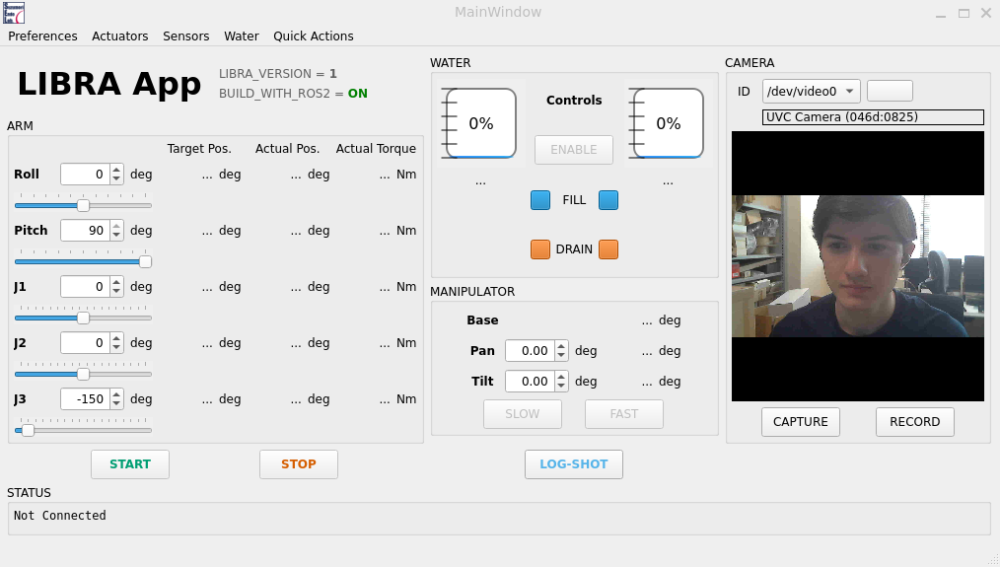

# LIBRA Control App

The LIBRA robotic arm project is being developed for the internal survey of dangerous spaces. This control application targets the first-generation LIBRA prototype: *LIBRA-I*.

Project link: <https://github.com/christian-brice/LIBRA-App>



## Table of Contents

- [Requirements](#requirements)
- [Optional Items](#optional-items)
    - [*VS Code Extensions*](#vs-code-extensions)
- [Usage](#usage)
    - [*Building the App*](#building-the-app)
    - [*Running the App*](#running-the-app)
    - [*Code Formatting*](#code-formatting)
    - [*Code Linting*](#code-linting)
- [Documentation](#documentation)
- [About Us](#about-us)
- [Acknowledgements](#acknowledgements)
- [Attribution](#attribution)
- [Contributing](#contributing)

## Requirements

| | Minimum | Recommended | Download Link |
|---|---|---|---|
| **Operating System** | Ubuntu 22.04.4<br>(Jammy) | Ubuntu 24.04<br>(Noble) | [ubuntu.com](https://ubuntu.com/download/alternative-downloads) |
| **C++ Standard** | C++17 | C++17 | N/A |
| **Qt** | 6.8.0<sup>1</sup> | 6.9.1 | [doc.qt.io](https://doc.qt.io/qt-6/get-and-install-qt.html) |
| **ROS2** | Humble Hawksbill<br>(humble)<sup>2</sup> | Humble Hawksbill<br>(humble) | [docs.ros.org](https://docs.ros.org/en/humble/Installation/Ubuntu-Install-Debs.html) |

<sup>1</sup> Qt 6.8 minimum required specifically for constructing a `QVideoFrame` from a `QImage` (used in `CameraManager`). See the official docs for [QVideoFrame::QvideoFrame()](https://doc.qt.io/qt-6/qvideoframe.html#QVideoFrame-2).

<sup>2</sup> The RTAB-Map ROS2 package repo specifically states "ROS2 Humble minimum required", although Jazzy is also supported (support for Rolling is currently in development). See their [README.md](https://github.com/introlab/rtabmap_ros?tab=readme-ov-file#rtabmap_ros).

## Optional Items

### *VS Code Extensions*

#### **Syntax Highlighting, Intellisense, Debugging**

- [C/C++](vscode:extension/ms-vscode.cpptools) by Microsoft
- [Better C++ Syntax](vscode:extension/jeff-hykin.better-cpp-syntax) by Jeff Hykin
- [CMake](vscode:extension/twxs.cmake) by twxs
- [CMake Tools](vscode:extension/ms-vscode.cmake-tools) by Microsoft
- [Error Lens](vscode:extension/usernamehw.errorlens) by Alexander

#### **Formatting and Linting**

- [Clang-Format](vscode:extension/xaver.clang-format) by Xaver Hellauer
- [cmake-format](vscode:extension/cheshirekow.cmake-format) by cheshirekow

#### **Convenience**

- [Doxygen Documentation Generator](vscode:extension/cschlosser.doxdocgen) by Christoph Schlosser
- [Doxygen Runner](vscode:extension/betwo.vscode-doxygen-runner) by betwo
- [Markdown All in One](vscode:extension/yzhang.markdown-all-in-one) by Yu Zhang

## Usage

### *Building the App*

If you want to get started as quickly as possible, you can run the provided build script via a terminal. If you are a developer, it's recommended you build the app and ROS2 tools separately via Qt Creator and colcon, respectively.

#### **Terminal**

Simply run the provided build script. By default, it will build the app for LIBRA-I with ROS2 support.

```bash
./tools/build-all.bash
```

It can also modify CMake flags.

```bash
# Build for LIBRA-II (in CMake: LIBRA_VERSION=2)
./tools/build-all.bash -v 2
# Build without ROS2 support (standalone) (in CMake: BUILD_WITH_ROS2=OFF)
./tools/build-all.bash --disable-ros2
```

#### **Qt Creator & Colcon**

This method provides a more fine-grained approach.

1) Use a terminal to build the `libra` package (and its dependencies) located in the `LIBRA-ROS2-Tools` submodule.

    ```bash
    # Navigate to the ROS2 Tools workspace
    cd LIBRA-ROS2-Tools/ros2_ws
    # Setup a ROS2 environment and build the "libra" package
    source /opt/ros/humble/setup.bash && colcon build --packages-up-to libra
    ```

2) In the same terminal, source the newly-created environment and launch Qt Creator. Then, click the gray "hammer" icon at the bottom left to build the app. Any errors will be output to the "Compile Output" tab at the bottom.

    ```bash
    # Add the "LIBRA ROS Tools" environment
    source LIBRA-ROS2-Tools/ros2_ws/install/setup.bash
    # Run Qt Creator
    qtcreator
    ```

    > ***NOTE:*** If you're getting the error `"Unknown CMake command "qt_xxx""`, you likely have an older version of Qt installed; Qt-specific CMake commands (starting with `qt_`) were added in Qt6. You can check which version you have by running Qt Creator, opening the "Help" tab at the top, and clicking "System Information".

#### **Build Options**

The following CMake options can be used to easily select which version of the app you want to compile. They can be changed either directly in the root `CMakeLists.txt` (see "CONFIG" section) or via the `cmake-gui` app, if you have it installed.

| Variable | Type | Possible<br>Values | Notes |
| --- | --- | --- | --- |
| `LIBRA_VERSION` | STRING | `1`, `2` | `1` = **LIBRA-I** (actuators: HEBI x5)<br>`2` = **LIBRA-II** (actuators: EPOS x1 + HEBI x1) |
| `BUILD_WITH_ROS2` | BOOL | `ON`, `OFF` | Whether to build with ROS2 support.<br>If disabled, the app will only rely on C++ standard library methods and Qt-based connections (e.g., signals and slots). |

### *Running the App*

This subsection lists the basic steps to get up and running. For detailed usage instructions, see [USAGE.md](./USAGE.md).

If you built the app with ROS2 support, you must first **source the ROS2 environments** in the terminals you will use for the following two steps.

```bash
source /opt/ros/humble/setup.bash
source LIBRA-ROS2-Tools/ros2_ws/install/setup.bash
```

#### **(1) Graphical User Interface (GUI)**

The app can be launched via a terminal or, if you need easy access to debugging tools, via Qt Creator.

- **Terminal** &ndash; Simply navigate to the build directory (the path is output to the terminal at the end of the CMake build step) and run the `libra_app` executable. Since the app uses certain files at runtime (e.g., to set the HEBI actuators' safety parameters), the executabale *must* be run from the directory it is in.

    ```bash
    cd build/libra-<1|2>-<ros|standalone>/
    ./libra_app
    ```

- **Qt Creator** &ndash; Open QtCreator and click the green "run" arrow at the bottom left.

    > ***NOTE:*** If you haven't built the project yet, or have made changes to the source code, clicking the green "run" arrow will automatically build it for you.

#### **(2) ROS2 Nodes**

⚠️ **TODO** ⚠️

Currently, the following instructions only run RTAB-Map with the RealSense RGB-D camera. Sensor fusion support with the 2D LIDAR is coming soon!

All the nodes necessary to run RTAB-Map have been compiled into a single launch file. Ensure you've sourced both ROS2 environments, then run the following in a terminal.

```bash
ros2 launch libra rtabmap_realsense_d456_stereo.launch.py
```

This will also launch the `realsense-ros` node which provides the ROS2 topic(s) `CameraManager` needs to stream images from the RealSense camera.

### *Code Formatting*

This project uses [Clang-Format](https://clang.llvm.org/docs/ClangFormat.html) to format C++ header (`.h`) and source (`.cpp`) files based on the parameters in the `.clang-format` file in this directory, and [cmake-format](https://github.com/cheshirekow/cmake_format) to format CMake (`CMakeLists.txt`) files based on the parameters in the `cmake-format.yaml` file in this directory.

If you installed the optional VS Code extensions of the same names, formatting should be automatically applied whenever you save a file.

> ***NOTE:*** If your cmake-format extension isn't working, the bash script at `tools/cmake-format-all.bash` will run it recursively for you.

### *Code Linting*

This project uses [Clang-Tidy](https://clang.llvm.org/extra/clang-tidy/) to diagnose typical programming errors and enforce modern coding standards in source files based on the parameters in the `.clang-tidy` file in this directory.

If you installed the optional VS Code extension "C/C++", linting will automaticaly begin whenever you save a file, and suggestions will be shown in highlighted lines after processing finishes (may take a short while depending on the size of the file).

## Documentation

This project uses [Doxygen](https://www.doxygen.nl/) to generate documentation from source code using comment tags such as `@brief` and `@param`.

If you installed the optional VS Code extension "Doxygen Runner", simply open the command palette (`Ctrl + Shift + P`) and select "Generate Doxygen documentation". The HTML and LaTeX documentation will be output to the `docs` directory.

> ***NOTE:*** The HTML documentation can be viewed by opening `html/index.html`, however the files in the `latex` directory must first be compiled by a LaTeX compiler to generate a PDF.

## About Us

**Christian Brice** ([email](mailto:brice.c.67b9@m.isct.ac.jp)) is a doctoral student in mechanical engineering at the Institute of Science Tokyo (formerly: Tokyo Institute of Technology). The *LIBRA* project is the focus of his doctoral studies.

The **[Gen Endo Laboratory](www.robotics.mech.e.titech.ac.jp/gendo/en/)** is affiliated with the Department of Mechanical Engineering at the Institute of Science Tokyo.

## Acknowledgements

*LIBRA-I*, the first-generation LIBRA robot on which this project is based on, as well as the original Windows-based "LIBRA-I_App", were developed by **Yuto Goto** (a former member of the Gen Endo Laboratory).

## Attribution

The **icons** used in this application are part of the Papirus icon theme, &copy; Papirus Development Team. Licensed under the GNU General Public License v3.0.
See: [https://github.com/PapirusDevelopmentTeam/papirus-icon-theme](https://github.com/PapirusDevelopmentTeam/papirus-icon-theme)

Most **colors** used in this application are compliant with Bang Wong's proposed colorblind-friendly palette.
See: [https://doi.org/10.1038/nmeth.1618](https://doi.org/10.1038/nmeth.1618)

## Contributing

1. Ensure Git is installed.

    ```bash
    sudo apt update
    sudo apt install git
    ```

    - If you're behind a proxy, you must also add your proxy settings to Git. In a terminal, input the following command (note: the `address` should be entered **with** the `http://` prefix).

        ```bash
        # (e.g., http://proxy.noc.titech.ac.jp:3128 for Gen Endo Lab)
        git config --global http.proxy <address>:<port>
        ```

2. In VS Code, open the command palette (`Ctrl + Shift + P`) and select "Git: Clone".
3. Enter `https://github.com/christian-brice/LIBRA-App.git` and select a directory to clone the project to.
